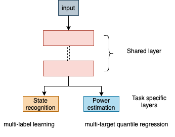
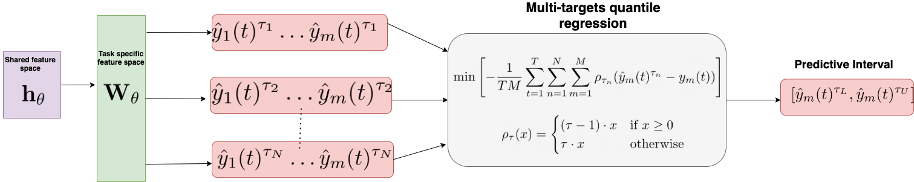
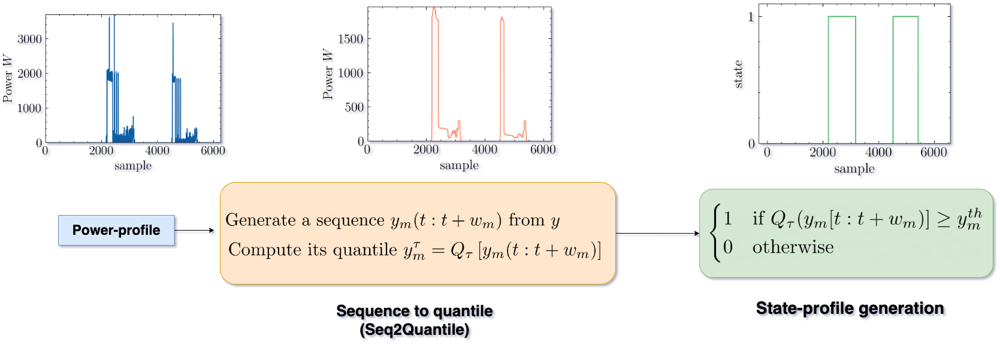
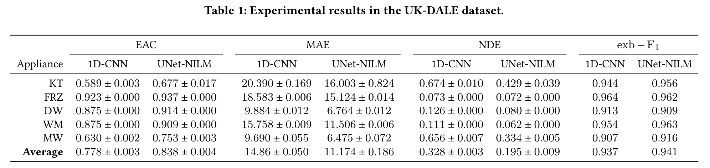
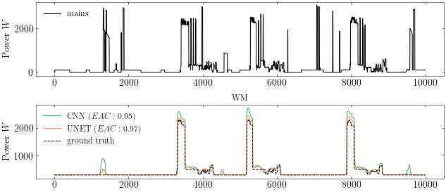

# Code for paper: UNet-NILM: A Deep Neural Network for Multi-tasks Appliances state detection and power estimation in NILM
This repository contains PyTorch code for our [paper](https://dl.acm.org/doi/10.1145/3427771.3427859):

> *Anthony Faustine, Lucas Pereira, Hafsa Bousbiat and Shridhar Kulkarni* "**UNet-NILM**: [A Deep Neural Network for Multi-tasks Appliances state detection and power estimation in NILM](https://dl.acm.org/doi/10.1145/3427771.3427859)
> [5th International Workshop on Non-Intrusive Load Monitoring (NILM), (co-located with ACM BuildSys 2020 and jointly organized with the EU NILM Workshop)](http://nilmworkshop.org/2020/)**

## Short summary of NILM
Nonintrusive load monitoring (NILM), or nonintrusive appliance load monitoring (NIALM), is a process for analyzing changes in the voltage and current going into a house and deducing what appliances are used in the house as well as their individual energy consumption. Over the years, an enormous amount of research has been exploring Deep Neural Networks (DNN) particularly Convolutional Neural Networks (CNNs) and Recurrent Neural Networks (RNNs) for NILM problems. However, most of the existing DNNs models for NILM use a single-task learning approach in which a neural network is trained exclusively for each appliance. In practicle, multiple appliances are active in the house and it is important to predict which appliance is active at the given time and how much power the appliance is consuming. 

> We propose

## Software requirements
We list our main python packages that are required. In principle our code should work with many different versions. Not all of these libraries are needed and the critical libraries that we use are:
* Python 3 (3.6.7
* sklearn
* pandas
* numpy
* [pytorch]()
* [pytorch lightning](https://www.pytorchlightning.ai/)
* Matplotlib 3.0.2

# Proposed method


### Multitarget State Detection

### Multitarget Quantile Regression


### Seq2quantile state generation


### UNet architecture

 
 


# Dataset and procedure to load


The data can be loaded using the script provided in `src/data/data_loader.py`.

   ```
   from data_loader import load_data , spilit_refit_test
   ```
   ```
   load_data("../data/", data_type="training", data="ukdale", denoise=True)
   ```

# Training models - experiment.py file
we have used pythorch lightning which provides high-level interface for [PyTorch](https://github.com/PyTorchLightning/pytorch-lightning). There are variety of options that can be specified in the `src/experiment.py`, however the large majority is set to a sensible default value and doesn't need to be tuned to reproduce the results of our paper. 


# Results
Table 1 summarizes the outcomes of our experiments on UK-DALEdataset for both UNet-NILM and the CNN baseline. 







