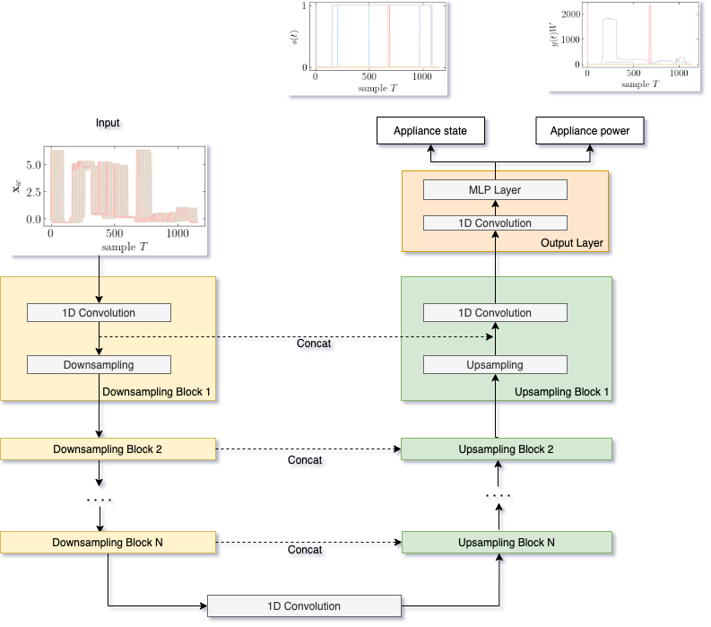
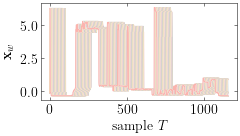

# Code for paper: UNet-NILM: A Deep Neural Network for Multi-tasks Appliances state detection and power estimation in NILM
This repository contains PyTorch code for our NIL conference 2020 [paper]():

> **A, B, C and D authors:
> *"UNet-NILM: A Deep Neural Network for Multi-tasks Appliances state detection and power estimation in NILM"*
> 5th International Workshop on Non-Intrusive Load Monitoring (NILM), (co-located with ACM BuildSys 2020 and jointly organized with the EU NILM Workshop)**

## Short summary of NILM
Nonintrusive load monitoring (NILM), or nonintrusive appliance load monitoring (NIALM), is a process for analyzing changes in the voltage and current going into a house and deducing what appliances are used in the house as well as their individual energy consumption. Over the years, an enormous amount of research has been exploring Deep Neural Networks (DNN) particularly Convolutional Neural Networks (CNNs) and Recurrent Neural Networks (RNNs) for NILM problems. However, most of the existing DNNs models for NILM use a single-task learning approach in which a neural network is trained exclusively for each appliance. In practicle, multiple appliances are active in the house and it is important to predict which appliance is active at the given time and how much power the appliance is consuming. It is clearlt the problem of multi-labeling and our paper addresses these challenges. 

## Software requirements
We list our main python packages that are required. In principle our code should work with many different versions. Not all of these libraries are needed and the critical libraries that we use are:
* Python 3 (3.6.7
* sklearn
* pandas
* numpy
* [pytorch_lightning](https://www.pytorchlightning.ai/)

and for visualization:
* Matplotlib 3.0.2

# Proposed method
The given an observed aggregate power signal, unobserved states `st` of electrical appliances are detected and the corresponding power consumption `yt`is estimated. The aggregate power consumption `xt`at time `t` can be expressed as:


## UNet architecture

 
 
The architecture of UNet-NiLM is as shown in figure. The UNet-NiLM is one dimensional CNN architecture consisting of the downsampling-upsampling blocks and output layer.The output layer consists of an𝑁-stages 1D CNN which cap-tures non-temporal dependencies across the feature map sequences and produce latent feature maps that is shared among themultiple tasks. The 1D CNN layers are followed by three MLP layers to produce lowe dimensions and to produce multilable state and power predictions. 

# Dataset and procedure to load
The proposed method is evaluated on a publicly available dataset:the UKDALE dataset. The UKDALE dataset contains aggregatepower consumption readings at1 Hzresolution and sub-meteredpower consumption at1/6 Hzresolution collected from five resi-dential buildings in the UK. The subset of appliances was selected for disaggrega-tion; kettle (KT), fridge (FRZ), dishwasher (DW), washing machine(WM), and microwave (MW). The sample of input sequence is as shown below:



The data can be loaded using the script provided in `src/data/data_loader.py`.

   ```
   from data_loader import load_data , spilit_refit_test
   ```
   ```
   load_data("../data/", data_type="training", data="ukdale", denoise=True)
   ```

# Training models - experiment.py file
we have used pythorch lightning which provides high-level interface for [PyTorch](https://github.com/PyTorchLightning/pytorch-lightning). There are variety of options that can be specified in the `src/experiment.py`, however the large majority is set to a sensible default value and doesn't need to be tuned to reproduce the results of our paper. 

# Evaluation methodology
To evaluate first implemented a baseline model (1D-CNN) based on the CNN architecture and comapred with UNet-NILM model. We have used three standard metricsused in NILM, namely the mean absolute error (MAE), estimated accuracy (EAC) and normalized disaggregation error (NDE). The MAE quantifies the error in predicted power at every time point such that:


The EAC metric gives the total estimated accuracy defined as


The NDE metric measures the normalized error of the squared difference between the prediction and the ground truth defined as


# Results
Table 1 summarizes the outcomes of our experiments on UK-DALEdataset for both UNet-NILM and the CNN baseline. 


